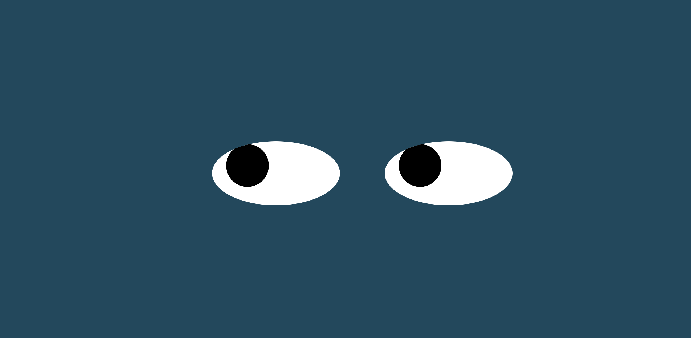

# Eyes
Eyeballs move with mouse movement

<h2>Description</h2>

This is an exercise where you can have control on how to move the eyeballs on a pair of eyes.

 

+ Only need to direct the mouse where you would like the eyeballs to move to. This done by creating the eyes and eyeballs on css, specifically using
document.onmousemove = () => {, and transform: translate on CSS and javascript.

 

<h2>Usage</h2>

Feel free to open the html file along with the images in the IDE of your choice where you could do the following things:

+ You may change the size of the eyes and eyballs.
+ Edit the color.
+ Add another pair of eyes.

<h2>Support</h2>

Should you have any questions or concerns email me anakorellana@gmail.com

<h2>RoadMap</h2>

The goal is to again practicd for loops, create shapes, imagages and movement with CSS and javascript programatically.

<h2>License</h2>

This is an open source project.Enjoy!

